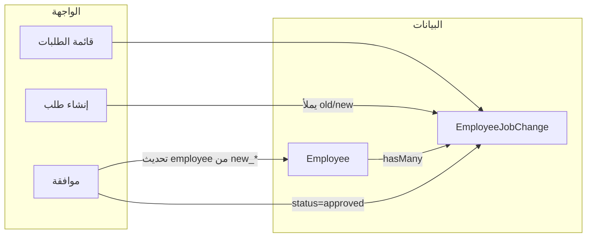

# خطة تفصيلية: النقل والترقية وسجل التغييرات (لموديل ذكاء اصطناعي)

الهدف من الخطة أن يكون تنفيذ الميزة واضحاً خطوة بخطوة لموديل ذكاء اصطناعي أو مطوّر، مع الإشارة إلى الملفات الموجودة في المشروع.

---

## 1. السياق الحالي في المشروع

- **الموظف:** [app/Models/Employee.php](app/Models/Employee.php) يحتوي على: `department_id`, `position_id`, `branch_id`, `manager_id`, `salary`, `employment_type`, `employment_status`. التعديل المباشر يتم من [app/Http/Controllers/Admin/EmployeeController.php](app/Http/Controllers/Admin/EmployeeController.php) (create/update).
- **الموافقات:** يوجد [app/Services/ApprovalService.php](app/Services/ApprovalService.php) و [app/Services/WorkflowService.php](app/Services/WorkflowService.php) لطلبات الإجازة والمصروفات وغيرها (مدير موظف، مدير قسم، دور، مستخدم محدد). يمكن لطلب التغيير الوظيفي أن يستخدم نفس النمط (موافق واحد أو أكثر) أو موافقة بسيطة (approved_by بدون workflow).
- **سجل التدقيق:** [app/Models/AuditLog.php](app/Models/AuditLog.php) يسجل التغييرات على النماذج عبر `LogsActivity` (old_values, new_values). المطلوب إضافة **سجل تغييرات وظيفية مخصص** (نقل، ترقية، تعديل راتب) قابل للعرض في واجهة إدارة الموارد البشرية.
- **الرواتب:** [app/Models/Salary.php](app/Models/Salary.php) سجل شهري للراتب؛ حقل `salary` في `employees` يمثل الراتب الحالي. عند تطبيق ترقية/تعديل راتب يُحدَّث `employee.salary` ويمكن إنشاء أو تحديث سجل في `salaries` لاحقاً حسب سياسة المشروع.

---

## 2. تصميم قاعدة البيانات

### 2.1 جدول `employee_job_changes`

إنشاء هجرة واحدة لجدول باسم `employee_job_changes` تحتوي على الحقول التالية:

- **الهوية والربط:**  
`id`, `employee_id` (foreignId → employees, cascadeOnDelete), `change_type` (string أو enum: transfer, promotion, salary_change, demotion).
- **الحالة والموافقة:**  
`status` (string: pending, approved, rejected), `effective_date` (date), `reason` أو `notes` (text, nullable), `requested_by` (foreignId → users, nullOnDelete), `approved_by` (foreignId → users, nullable, nullOnDelete), `approved_at` (timestamp, nullable), `rejection_reason` (text, nullable).
- **لقطة القيم قبل وبعد (للنقل/الترقية/الراتب):**  
  - القسم: `old_department_id`, `new_department_id` (nullable, foreignId → departments, nullOnDelete).  
  - المنصب: `old_position_id`, `new_position_id` (nullable, foreignId → positions, nullOnDelete).  
  - الفرع: `old_branch_id`, `new_branch_id` (nullable, foreignId → branches, nullOnDelete).  
  - المدير: `old_manager_id`, `new_manager_id` (nullable, foreignId → employees, nullOnDelete).  
  - الراتب: `old_salary` (decimal 10,2 nullable), `new_salary` (decimal 10,2 nullable).
- **زمنية:**  
`timestamps`.
- **فهارس:**  
index على `employee_id`, `status`, `effective_date`, `created_at`.

**ملاحظة:** عند إنشاء الطلب، يُملأ الحقلان `old_`* و `new_`* المناسبان من بيانات الموظف الحالية والقيم المختارة في النموذج. عند الموافقة يتم تطبيق قيم `new_`* على سجل الموظف.

---

## 3. النماذج (Models)

### 3.1 نموذج `EmployeeJobChange`

- **المسار:** `app/Models/EmployeeJobChange.php`.
- **الحقول القابلة للتعبئة:** جميع حقول الجدول ما عدا الـ id والـ timestamps؛ مع العلاقات: `employee`, `requestedBy` (User), `approvedBy` (User), `oldDepartment`, `newDepartment`, `oldPosition`, `newPosition`, `oldBranch`, `newBranch`, `oldManager`, `newManager` (كلها BelongsTo مع الحقول المناسبة).
- **Casts:**  
`effective_date` => date, `approved_at` => datetime, `old_salary` => decimal:2, `new_salary` => decimal:2.
- **ثوابت:**  
مثلاً `CHANGE_TYPE_TRANSFER`, `CHANGE_TYPE_PROMOTION`, `CHANGE_TYPE_SALARY_CHANGE`, `CHANGE_TYPE_DEMOTION` و `STATUS_PENDING`, `STATUS_APPROVED`, `STATUS_REJECTED`.
- **Scopes (اختياري):**  
`scopePending`, `scopeApproved`, `scopeForEmployee($employeeId)`.
- **Accessors للعرض بالعربية:**  
مثلاً `getChangeTypeLabelAttribute()`, `getStatusLabelAttribute()` ترجع نصوص عربية لنوع التغيير والحالة.

### 3.2 تحديث نموذج `Employee`

- في [app/Models/Employee.php](app/Models/Employee.php) إضافة علاقة:  
`jobChanges(): HasMany(EmployeeJobChange::class)` مرتبة حسب `effective_date` أو `created_at` تنازلياً.
- لا حاجة لتعديل fillable أو أي منطق آخر للموظف إلا إذا رغبت لاحقاً في دالة مساعدة مثل `applyJobChange(EmployeeJobChange $change)` داخل النموذج؛ يمكن تنفيذ التطبيق في الـ Controller أو في Service منفصل.

---

## 4. المتحكم والمسارات

### 4.1 المتحكم `EmployeeJobChangeController` (Admin)

- **المسار:** `app/Http/Controllers/Admin/EmployeeJobChangeController.php`.
- **Middleware:** `auth` ويفضل صلاحية مثل `job-change-list`, `job-change-create`, `job-change-approve` إن وُجدت في المشروع؛ إن لم توجد الاكتفاء بـ `auth`.
- **الدوال:**
  - **index(Request $request):** عرض قائمة طلبات التغيير مع إمكانية فلترة حسب: employee_id, status, change_type, تاريخ من/إلى. استخدام paginate (مثلاً 15). تمرير قائمة موظفين نشطين للفلتر (اختياري). إرجاع view: `admin.pages.employee-job-changes.index`.
  - **create():** جلب الموظفين النشطين، الأقسام، المناصب، الفروع (للقوائم المنسدلة). إرجاع view: `admin.pages.employee-job-changes.create`.
  - **store(Request $request):** التحقق من الحقول: employee_id (مطلوب، exists:employees), change_type (مطلوب، in: transfer, promotion, salary_change, demotion), effective_date (مطلوب، date), reason (nullable), وقيم new_* حسب نوع التغيير (مثلاً عند transfer: new_department_id أو new_branch_id أو new_position_id؛ عند promotion/salary_change: new_position_id و/أو new_salary). قبل الحفظ: تعبئة حقول old_* من سجل الموظف الحالي (department_id, position_id, branch_id, manager_id, salary). تعيين status = pending و requested_by = auth()->id(). بعد الحفظ إعادة توجيه إلى index مع رسالة نجاح.
  - **show(EmployeeJobChange $employeeJobChange):** تحميل العلاقات (employee, requestedBy, approvedBy, oldDepartment, newDepartment, ...). إرجاع view: `admin.pages.employee-job-changes.show`.
  - **edit(EmployeeJobChange $employeeJobChange):** يُسمح بالتعديل فقط إذا status = pending. نفس بيانات create مع تمرير الطلب. إرجاع view: `admin.pages.employee-job-changes.edit`.
  - **update(Request $request, EmployeeJobChange $employeeJobChange):** نفس قواعد التحقق مثل store؛ تحديث الطلب فقط إن كان pending. إعادة توجيه إلى show أو index.
  - **approve(Request $request, EmployeeJobChange $employeeJobChange):** التحقق من أن status = pending. تحديث الطلب: status = approved, approved_by = auth()->id(), approved_at = now(). ثم **تطبيق التغيير على الموظف:** تحديث employee.department_id من new_department_id إن وُجد، وكذلك position_id, branch_id, manager_id, salary من القيم new_* غير الفارغة. إعادة توجيه مع رسالة نجاح.
  - **reject(Request $request, EmployeeJobChange $employeeJobChange):** التحقق من أن status = pending. تحديث status = rejected و rejection_reason من الـ request (إن وُجد). إعادة توجيه مع رسالة.
- **لا دالة destroy مطلوبة في الخطة** إلا إذا رغبت بحذف طلبات مرفوضة أو مسودات؛ يمكن تركها لاحقاً.

### 4.2 المسارات

- في [routes/admin.php](routes/admin.php) داخل مجموعة الـ admin الحالية:
  - `Route::resource('employee-job-changes', EmployeeJobChangeController::class)->except(['destroy']);`
  - `Route::post('employee-job-changes/{employee_job_change}/approve', [EmployeeJobChangeController::class, 'approve'])->name('employee-job-changes.approve');`
  - `Route::post('employee-job-changes/{employee_job_change}/reject', [EmployeeJobChangeController::class, 'reject'])->name('employee-job-changes.reject');`
- التأكد من أن مسار الموافقة/الرفض معرّف **قبل** الـ resource حتى لا يُلتقط `approve` كـ id.

---

## 5. الواجهات (Blade)

استخدام تخطيط الإدارة الحالي (مثلاً `admin.layouts.master`) وبنية الصفحات المشابهة لـ [resources/views/admin/pages/contracts/](resources/views/admin/pages/contracts/) أو [resources/views/admin/pages/leave-requests/](resources/views/admin/pages/leave-requests/).

### 5.1 قائمة الطلبات — `index.blade.php`

- عنوان الصفحة: "طلبات النقل والترقية" أو "التغييرات الوظيفية".
- رابط: "إضافة طلب تغيير وظيفي" إلى `route('admin.employee-job-changes.create')`.
- فلاتر: موظف (قائمة منسدلة)، الحالة (pending, approved, rejected)، نوع التغيير، تاريخ من/إلى (اختياري). زر بحث وزر مسح.
- جدول أعمدة: #، الموظف، نوع التغيير، التاريخ الفعال، الحالة، تاريخ الطلب، عمليات (عرض، تعديل إن كان pending، موافقة، رفض).
- زر الموافقة/الرفض يفتح مودال أو يوجه لصفحة تأكيد ثم POST إلى approve/reject.
- Pagination أسفل الجدول.

### 5.2 إنشاء طلب — `create.blade.php`

- نموذج POST إلى `route('admin.employee-job-changes.store')` مع @csrf.
- حقول مطلوبة: الموظف (select من الموظفين النشطين)، نوع التغيير (transfer, promotion, salary_change, demotion)، التاريخ الفعال (date)، ملاحظات (textarea اختياري).
- حسب نوع التغيير إظهار/إخفاء حقول (يمكن بـ JavaScript):
  - **نقل (transfer):** القسم الجديد، المنصب الجديد، الفرع الجديد، المدير الجديد (اختياري لكل).
  - **ترقية (promotion):** المنصب الجديد، الراتب الجديد (اختياري).
  - **تعديل راتب (salary_change):** الراتب الجديد فقط.
  - **تنزيل (demotion):** المنصب الجديد، الراتب الجديد (اختياري).
- أزرار: حفظ الطلب، إلغاء (رابط للـ index).

### 5.3 عرض طلب — `show.blade.php`

- عرض تفاصيل الطلب: الموظف (مع رابط لملف الموظف)، نوع التغيير، الحالة، التاريخ الفعال، الملاحظات، من طلب، من وافق، تاريخ الموافقة، سبب الرفض إن وُجد.
- جدول أو قائمة "قبل / بعد": القسم، المنصب، الفرع، المدير، الراتب (عرض القيم القديمة والجديدة فقط للحقول التي تغيرت).
- إن كانت الحالة pending وعند المستخدم صلاحية الموافقة: أزرار "موافقة" و "رفض" (نموذج POST أو مودال مع rejection_reason للرفض).

### 5.4 تعديل طلب — `edit.blade.php`

- نفس حقول create مع تعبئة القيم الحالية للطلب. يظهر فقط للطلبات ذات الحالة pending. تحديث عبر PUT إلى `route('admin.employee-job-changes.update', $employeeJobChange)`.

### 5.5 مودال أو صفحة رفض (اختياري)

- إن كان الرفض عبر مودال: حقل نص لسبب الرفض وزر إرسال ينفذ POST إلى `employee-job-changes.reject` مع `rejection_reason`.

---

## 6. سجل التغييرات في الملف الوظيفي

### 6.1 عرض السجل في صفحة الموظف

- في [app/Http/Controllers/Admin/EmployeeController.php](app/Http/Controllers/Admin/EmployeeController.php) داخل دالة **show** (عرض تفاصيل الموظف): جلب الطلبات المعتمدة لهذا الموظف:  
`$jobChangeHistory = EmployeeJobChange::where('employee_id', $employee->id)->where('status', 'approved')->orderByDesc('effective_date')->get();`  
وتمريرها إلى الـ view.
- في view عرض الموظف [resources/views/admin/pages/employees/show.blade.php](resources/views/admin/pages/employees/show.blade.php) إضافة قسم جديد: "سجل التغييرات الوظيفية" (أو "النقل والترقية"). عرض جدول أو بطاقات: التاريخ الفعال، نوع التغيير، ملخص التغيير (مثلاً: من قسم X إلى قسم Y، من منصب A إلى منصب B، من راتب قديم إلى جديد). إن لم يكن هناك سجل، عرض رسالة "لا يوجد سجل تغييرات".

### 6.2 صفحة مستقلة لسجل التغييرات (اختياري)

- يمكن إضافة route مثل `employee-job-changes.history` مع employee_id وعرض نفس البيانات في صفحة مخصصة مع فلترة إضافية.

---

## 7. القائمة الجانبية ولوحة التحكم

- في [resources/views/admin/layouts/main-sidebar.blade.php](resources/views/admin/layouts/main-sidebar.blade.php) إضافة رابط "النقل والترقية" أو "التغييرات الوظيفية" داخل مجموعة مناسبة (مثلاً "إدارة الموارد البشرية" أو "إدارة الموظفين المتقدمة") يشير إلى `route('admin.employee-job-changes.index')`.
- (اختياري) في لوحة التحكم: بطاقة أو رقمان لـ "طلبات نقل/ترقية قيد الانتظار" مع رابط إلى index مفلتر بـ status=pending.

---

## 8. تسلسل التنفيذ المقترح للموديل

1. **إنشاء الهجرة:** إنشاء ملف migration لجدول `employee_job_changes` بجميع الحقول والفهارس والعلاقات الأجنبية المذكورة أعلاه، ثم تشغيل `php artisan migrate`.
2. **إنشاء النموذج:** إنشاء `App\Models\EmployeeJobChange` مع fillable, casts, ثوابت، علاقات، scopes و accessors للعرض بالعربية.
3. **تحديث Employee:** إضافة علاقة `jobChanges()` في نموذج الموظف.
4. **إنشاء المتحكم:** إنشاء `EmployeeJobChangeController` مع index, create, store, show, edit, update, approve, reject وتطبيق التغيير على الموظف داخل approve.
5. **تسجيل المسارات:** إضافة مسارات الـ resource و approve و reject في admin.php.
6. **إنشاء الواجهات:** إنشاء مجلد `resources/views/admin/pages/employee-job-changes/` وملفات index, create, edit, show والمودال أو النموذج للرفض إن لزم.
7. **ربط سجل التغييرات بصفحة الموظف:** في EmployeeController@show جلب الطلبات المعتمدة وتمريرها؛ في view عرض الموظف إضافة قسم "سجل التغييرات الوظيفية".
8. **إضافة الرابط في القائمة الجانبية** ثم (اختياري) تحديث لوحة التحكم.
9. **تحديث ملف الميزات:** في [HR_FEATURES_RECOMMENDATIONS.md](HR_FEATURES_RECOMMENDATIONS.md) تسجيل أن ميزة "النقل والترقية وسجل التغييرات" تم تنفيذها.

---

## 9. رسم تدفق مبسط

---

## 10. ملاحظات للتنفيذ الآمن

- عند تطبيق الموافقة: التحقق من أن القيم الجديدة (new_department_id, new_position_id, إلخ) موجودة ولم تُحذف؛ استخدام `nullOnDelete` في الهجرة يمنع كسر الـ FK.
- عدم السماح بتعديل أو موافقة/رفض طلب غير pending.
- إن وُجدت صلاحيات (Spatie): إنشاء أذونات مثل `employee-job-change-list`, `employee-job-change-create`, `employee-job-change-approve` وربطها بالمتحكم حسب سياسة المشروع.
- يمكن لاحقاً ربط طلبات التغيير بـ Workflow و WorkflowService إذا رغبت بموافقة متعددة المراحل؛ الخطة الحالية تكفي بموافقة واحدة (approved_by).

بعد تنفيذ هذه الخطوات يكون النظام يدعم طلبات النقل والترقية وتعديل الراتب وسجلاً واضحاً للتغييرات المعتمدة في الملف الوظيفي.
