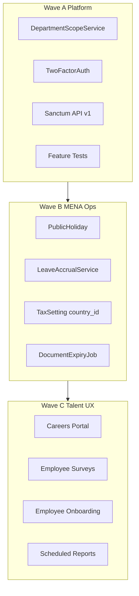

# HRIS Gap Analysis — MENA Multi-Country Design Spec

**Date:** 2026-06-01  
**Context:** Single company, multiple countries/branches (MENA)  
**Status:** Approved for phased implementation

---

## 1. Purpose

Document functional gaps between the current Laravel HR platform and a mature multi-country HRIS, with priorities, acceptance criteria, and wave boundaries. This spec does not replace [`plan/ideal-system-roadmap.md`](../../../plan/ideal-system-roadmap.md); it operationalizes it for MENA.

---

## 2. Current strengths (preserve)

| Domain | Maturity | Reference |
|--------|----------|-----------|
| Employee master & org | High | `plan/features/employees-and-directory.md` |
| Leave & attendance | Medium–High | Shifts, GPS, overtime |
| Payroll cycle | Medium–High | Payroll, components, tax settings |
| Workflow & approvals | High | `ApprovalService`, `WorkflowService` |
| Employee portal | High | `routes/employee.php` |
| RBAC | High | Spatie + department head scope (partial) |

---

## 3. Gap matrix (priority × wave)

| ID | Gap | Wave | Priority | Acceptance criteria |
|----|-----|------|----------|---------------------|
| G-A1 | Department scope on all employee-data admin controllers | A | P0 | Dept head with `payroll-list` sees only managed employees’ payrolls |
| G-A2 | MFA (TOTP) for admin/payroll roles | A | P0 | User can enable 2FA; login requires OTP when enabled |
| G-A3 | Audit on sensitive actions | A | P1 | Payroll approve, permission sync, document download logged |
| G-A4 | REST API v1 (Sanctum) | A | P0 | Token auth; endpoints: attendance summary, leave balance/request, notifications |
| G-A5 | Feature tests for critical paths | A | P0 | Tests pass for scope, leave request, API auth |
| G-B1 | Public holidays per country/branch | B | P0 | CRUD holidays; attendance/leave calculations can exclude them |
| G-B2 | Leave accrual engine | B | P0 | Monthly job increases `leave_balances` per configurable rules |
| G-B3 | Tax/social insurance per country | B | P1 | `tax_settings.country_id`; payroll uses employee branch/country rules |
| G-B4 | Document/certificate expiry alerts | B | P1 | Daily job notifies HR + employee before expiry |
| G-C1 | Public careers portal | C | P1 | `/careers` lists published vacancies; public apply form |
| G-C2 | Surveys from employee portal | C | P2 | Employee completes assigned surveys |
| G-C3 | Onboarding tasks on employee portal | C | P2 | New hire sees checklist; can mark tasks done |
| G-C4 | Scheduled reports + KPI dashboard | C | P2 | Admin configures schedule; email with export; dashboard KPI cards |

---

## 4. Architecture

---

## 5. Data model additions (Wave B)

### `public_holidays`

- `country_id` (nullable), `branch_id` (nullable)
- `name`, `name_ar`, `holiday_date`, `is_recurring` (bool), `notes`

### `leave_accrual_rules`

- `leave_type_id`, `country_id` (nullable), `branch_id` (nullable)
- `accrual_days_per_month` (decimal), `max_balance`, `is_active`

### `tax_settings`

- Add `country_id` (nullable FK)

### `scheduled_reports`

- `name`, `report_type`, `frequency`, `recipients` (json), `filters` (json), `last_run_at`, `is_active`

### `users` (Wave A)

- `two_factor_secret`, `two_factor_recovery_codes`, `two_factor_confirmed_at`

---

## 6. API v1 surface (Wave A)

Prefix: `/api/v1`  
Auth: `Authorization: Bearer {sanctum_token}`

| Method | Path | Description |
|--------|------|-------------|
| GET | `/me` | Current user + employee id |
| GET | `/attendance` | Month summary for authenticated employee |
| GET | `/leave-balances` | Balances for current year |
| POST | `/leave-requests` | Create leave request |
| GET | `/notifications` | Unread notifications |

---

## 7. Out of scope (this spec)

- Spatie Teams / full ABAC
- Multi-tenant SaaS
- WPS/Mudad hard-coded exporters (future compliance packs)
- Full LMS / SCORM
- SSO SAML (Wave A uses MFA only; SSO deferred)

---

## 8. Implementation order

1. Wave A — security & platform (scope, MFA, API, tests)  
2. Wave B — MENA operations (holidays, accrual, country tax, alerts)  
3. Wave C — talent & UX (careers, employee surveys/onboarding, scheduled reports)

---

## 9. References

- [`plans/COMPREHENSIVE_SYSTEM_ANALYSIS.md`](../../../plans/COMPREHENSIVE_SYSTEM_ANALYSIS.md)
- [`plan/ideal-system-roadmap.md`](../../../plan/ideal-system-roadmap.md)
- [`docs/superpowers/specs/2026-06-01-admin-permissions-department-head-design.md`](2026-06-01-admin-permissions-department-head-design.md)
